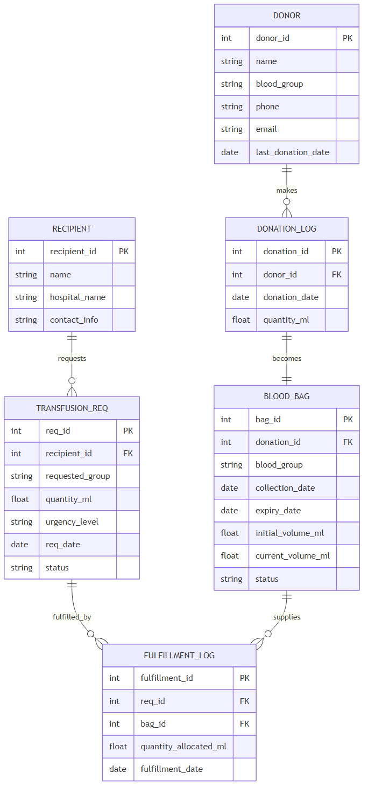

# Blood Bank Management System - Project Report

## Abstract
Blood Bank Management Systems (BBMS) are critical infrastructure in modern healthcare, ensuring the timely availability of life-saving blood components. Traditional manual or semi-automated systems often suffer from inventory inaccuracies, lack of real-time visibility, and inefficient allocation strategies that lead to blood wastage due to expiration or improper prioritization. This project presents a comprehensive, web-based Blood Bank Management System designed to address these challenges through granular volume tracking and an intelligent "Smart Allocation" algorithm.

Unlike conventional systems that track blood units as discrete integers, this system implements a continuous volume tracking mechanism (in milliliters), allowing for partial usage of blood bags and precise inventory management. The core innovation lies in its allocation logic, which strictly prioritizes requests based on medical urgency ("Critical" vs. "Normal") and optimizes stock usage using a First-In-First-Out (FIFO) strategy based on expiry dates. This ensures that the oldest available compatible blood is used first, significantly reducing wastage.

The system is built using Python with the Flask framework, leveraging a robust SQLite relational database to maintain data integrity. It features distinct modules for donor management, hospital/recipient coordination, and real-time inventory monitoring. The user interface provides a live dashboard with critical alerts, enabling administrators to make informed decisions instantly. This report details the system's architecture, database design, and implementation strategies, demonstrating a scalable solution for modernizing blood bank operations.

## Synopsis
The Blood Bank Management System is a centralized platform designed to bridge the gap between blood donors and hospitals in need. The system facilitates the entire lifecycle of blood donation and transfusion:
1.  **Donation Processing:** Donors are registered with their unique blood groups. Every donation is recorded with a specific milliliter volume, which automatically populates the inventory as a distinct "Blood Bag" with a 42-day lifespan.
2.  **Granular Inventory:** The system monitors the `current_volume_ml` of every bag in the bank. This allows the system to handle complex fulfillment scenarios where a single bag can be split across multiple smaller requests.
3.  **Request Management:** Hospitals log transfusion requests including the specific blood group needed, the volume required for the patient, and a triaged urgency level.
4.  **Smart Allocation Algorithm:** The system's core engine automates the matching of compatible blood groups and the distribution of stock based on medical priority and expiry proximity.
5.  **Traceability:** Every allocation is logged in a fulfillment history, mapping which bag provided how much volume to which specific hospital request.

## Problem Statement
Traditional blood bank management faces several systemic hurdles:
*   **Inventory Inaccuracy:** Units are often treated as indivisible blocks. If a patient only needs 200ml of a 450ml bag, the remaining 250ml is often poorly tracked or wasted.
*   **Wastage through Expiration:** Without automated FIFO (First-In-First-Out) enforcement, newer donations may be used while older stock expires unnoticed.
*   **Priority Management:** In supply shortages, manual systems struggle to dynamically prioritize a "Critical" trauma patient over "Normal" elective procedures.
*   **Compatibility Risks:** Manual cross-matching of compatible groups (e.g., O- as a universal donor) introduces the risk of human error in high-pressure environments.
*   **Lack of Real-time Visibility:** Administrators often lack a "single pane of glass" view of total volume available across different blood groups and pending critical needs.

## Implementation Plan
The project was executed through a structured development methodology:
1.  **Requirement Analysis:** Defining the specific entities (Donors, Bags, Requests) and the mathematical rules for blood compatibility.
2.  **Database Architecture:** Designing a relational schema in SQLite that enforces data integrity through Foreign Keys and transactional boundaries.
3.  **Backend Logic Development:** Implementing the core Python engine for processing donations and the smart allocation loop.
4.  **Web Interface Integration:** Developing a Flask-based application to serve dynamic HTML content and handle form submissions.
5.  **UI/UX Refinement:** Organizing the dashboard to highlight "Critical Alerts" and current stock levels for immediate administrative action.

## Project Member
*   **Abdul Ahad**

---

## ER Design

### ER Diagram

### Description of Entities
1.  **DONOR:** Stores the master record of donors, including their name, contact details, and unique blood group. It also maintains a `last_donation_date` to ensure compliance with medical safety intervals.
2.  **RECIPIENT:** Represents the hospitals or medical centers requiring blood. It captures the facility name and contact information for logistics and coordination.
3.  **DONATION_LOG:** A bridge table that records the actual event of a donation. It captures the date and the specific volume (quantity_ml) collected from a donor.
4.  **BLOOD_BAG:** The inventory tracking entity. Every record here represents a physical bag of blood. It links back to a `donation_id` and tracks its `expiry_date`, `initial_volume_ml`, and `current_volume_ml`.
5.  **TRANSFUSION_REQ:** Represents a pending hospital request. It includes the `requested_group`, `quantity_ml`, `urgency_level` (Normal/Critical), and the current `status` (Pending/Fulfilled).
6.  **FULFILLMENT_LOG:** The audit trail table. It records the precise allocation of milliliters from a specific `bag_id` to a specific `req_id`, ensuring 1:N and N:M fulfillment scenarios are fully documented.

### Normalized Tables
The database is structured in 3rd Normal Form (3NF) to prevent data redundancy and ensure consistency:
*   **DONOR** (`donor_id` PK, `name`, `blood_group`, `phone`, `email`, `last_donation_date`)
*   **RECIPIENT** (`recipient_id` PK, `name`, `hospital_name`, `contact_info`)
*   **DONATION_LOG** (`donation_id` PK, `donor_id` FK, `donation_date`, `quantity_ml`)
*   **BLOOD_BAG** (`bag_id` PK, `donation_id` FK, `blood_group`, `collection_date`, `expiry_date`, `initial_volume_ml`, `current_volume_ml`, `status`)
*   **TRANSFUSION_REQ** (`req_id` PK, `recipient_id` FK, `requested_group`, `quantity_ml`, `urgency_level`, `req_date`, `status`)
*   **FULFILLMENT_LOG** (`fulfillment_id` PK, `req_id` FK, `bag_id` FK, `quantity_allocated_ml`, `fulfillment_date`)

---

## UI Design
The interface is optimized for high-stakes administrative tasks, using a clean layout:

1.  **Home Dashboard:**
    *   **Alerts Section:** Displays "Critical Pending Alerts" in a bold ticker format. It aggregates the total volume needed for each blood group categorized as Critical.
    *   **Inventory Table:** Shows the "Stock Ticker" which summarizes total bags and total volume available per blood group.
    *   **Detailed Inventory:** A list of all available bags sorted by expiry, providing granular visibility into individual stock items.
    *   **Transaction Logs:** Recent donations and recent fulfillments are shown to provide an immediate audit of daily activity.

2.  **Donor Portal:**
    *   **Registration:** A dedicated form for onboarding new donors.
    *   **Donation Entry:** A panel that allows selecting an existing donor and recording a new donation quantity, which triggers the automatic creation of a Blood Bag and an update to the donor's last donation date.

3.  **Hospital Portal:**
    *   **Hospital Management:** Form to register new medical facilities.
    *   **Request Entry:** Interface to log transfusion needs, requiring volume in ml and an urgency selection.

---

## Detailed Report

### 1. Introduction
The management of blood inventory is one of the most complex challenges in modern medical logistics. Unlike pharmaceutical drugs, blood is a living tissue with a strictly limited shelf life (typically 42 days for red blood cells). It cannot be manufactured and relies entirely on human donations. Furthermore, the demand for blood is highly stochastic; a single traffic accident or major surgery can deplete a hospital's stock of a specific blood group in minutes.

The primary objective of this project, the **Blood Bank Management System (BBMS)**, is to digitize and optimize these operations. The project moves beyond simple record-keeping to provide an **Active Decision Support System**. It addresses the "Unit vs. Volume" dichotomy—where traditional systems track "1 Unit" regardless of whether it is 350ml or 450ml—by implementing precise volume tracking. This granularity allows for the optimization of resource usage, especially in pediatric cases where small aliquots are needed, preventing the wastage of the remainder of a full adult unit.

### 2. System Analysis and Requirements

#### 2.1 Functional Requirements
The system was designed to meet four core functional pillars:
1.  **Donation & Supply Management:** The system must register donors and record donations. Crucially, it must convert a "Donation Event" into an "Inventory Item" (Blood Bag) automatically, calculating the expiry date based on the collection date.
2.  **Inventory Tracking:** The system must maintain a real-time view of all blood bags. It must track the `initial_volume` (for historical yield analysis) and `current_volume` (for availability). The status of a bag must automatically transition from `Available` to `Empty` when its volume is depleted.
3.  **Request & Demand Management:** Hospitals must be able to place requests. These requests must carry a `urgency_level` tag (`Critical` or `Normal`) to allow the system to triage life-threatening situations over elective ones.
4.  **Automated Allocation:** The system must provide a "Smart Allocate" function that automatically matches supply to demand, respecting blood group compatibility rules and prioritizing the oldest stock to minimize wastage (FIFO).

#### 2.2 Non-Functional Requirements
*   **Data Integrity:** Given the medical nature of the data, the system must never allow an "Orphaned" bag (a bag with no donor) or a "Ghost" fulfillment (blood allocated to a non-existent request).
*   **Atomicity:** All complex operations (like splitting a bag across two requests) must be atomic. If the system fails to update the request status, it must not deduct the blood volume, and vice versa.
*   **Concurrency:** The database must handle multiple reads and writes without corrupting inventory counts.

### 3. System Design and Methodology

#### 3.1 Architectural Pattern: Model-View-Controller (MVC)
The project adopts the standard MVC architecture, implemented via the Flask framework.
*   **Model (Data Layer):** The state of the system is held in a relational SQLite database. The schema definition (`db_init.py`) serves as the single source of truth for the data structure.
*   **View (Presentation Layer):** The user interface is decoupled from the logic. Jinja2 templates (`.html` files) handle the rendering of data. This allows the backend to remain API-centric (returning lists of dictionaries) while the frontend handles formatting (tables, badges, alerts).
*   **Controller (Logic Layer):** The application logic is split into two distinct controllers:
    *   `app/logic.py`: Contains the "Pure Business Logic"—algorithms for compatibility, sorting, and database transactions. This file knows nothing about HTTP or HTML.
    *   `main.py`: Contains the "Application Controller Logic"—handling HTTP routes, parsing form data, and deciding which template to render.

#### 3.2 Database Design Philosophy
The database schema was designed to be in **Third Normal Form (3NF)** to eliminate redundancy.
*   **Separation of Donor and Donation:** A common mistake in simple systems is to store donation info on the donor record. Here, `DONOR` and `DONATION_LOG` are separate. One donor can have multiple donations. This allows for longitudinal tracking of a donor's history.
*   **Separation of Donation and Inventory:** `DONATION_LOG` records the *event* (history), while `BLOOD_BAG` records the *asset* (current stock). This separation allows the system to track the *depletion* of a bag without altering the historical record of how much was originally donated.
*   **Normalization of Fulfillment:** The `FULFILLMENT_LOG` is a many-to-many join table between `TRANSFUSION_REQ` and `BLOOD_BAG`. This is critical because:
    *   One large request (e.g., 800ml) might be filled by two bags (450ml + 350ml).
    *   One bag (450ml) might fill two small pediatric requests (50ml + 50ml).
    *   A simple foreign key on the Request table would not support this complex N:M relationship.

### 4. Algorithmic Logic: The "Smart Allocation" Engine

The `smart_allocate_all` function in `app/logic.py` represents the computational core of the project. It operates in a strict sequence:

#### 4.1 Step 1: Priority Queue Construction
The system first queries all `TRANSFUSION_REQ` where `status = 'Pending'`. It applies a composite sorting key:
1.  **Primary Sort Key: Urgency Level.** The algorithm explicitly maps `Critical` to a higher priority value than `Normal`. This ensures that a critical request logged *today* takes precedence over a normal request logged *yesterday*.
2.  **Secondary Sort Key: Quantity (Descending).** Among requests of equal urgency, the system prioritizes the largest volume needs. This heuristic assumes that larger volume requests represent more severe hemorrhaging or major surgeries.

#### 4.2 Step 2: Compatibility Resolution
For every request, the system determines the valid source blood groups using a **Compatibility Matrix**.
*   **Logic:** `get_compatible_blood_groups(target_group)`
*   **Example:** If the request is for `B-`, the system allows `B-` and `O-`. If the request is `AB+`, the system allows ALL groups.
*   **Implementation:** This is implemented as a Python dictionary lookup, which is O(1) in complexity, ensuring high speed even with many requests.

#### 4.3 Step 3: Inventory Filtering and Sorting (FIFO)
The system queries the `BLOOD_BAG` table for candidates.
*   **Filter 1:** `status = 'Available'`.
*   **Filter 2:** `current_volume_ml > 0`.
*   **Filter 3:** `blood_group` must be in the compatible list derived in Step 2.
*   **Sorting:** `ORDER BY expiry_date ASC`. This is the **FIFO (First-In-First-Out)** mechanism. By selecting the bag closest to expiration, the system strictly minimizes the loss of inventory due to time decay.

#### 4.4 Step 4: The Volume Deduction Loop
The allocation is performed iteratively:
*   The system calculates `amount_needed = total_requested - amount_allocated_so_far`.
*   It picks the first bag from the sorted list.
*   It determines `amount_to_take = min(bag_current_volume, amount_needed)`.
*   **Database Update 1:** It subtracts `amount_to_take` from the bag's `current_volume_ml`.
*   **Database Update 2:** If the bag volume hits 0, it updates the bag status to `Empty`.
*   **Database Update 3:** It inserts a record into `FULFILLMENT_LOG` recording that "Bag X gave Y ml to Request Z".
*   **Loop Condition:** The loop continues to the next bag until the request is 100% filled.

### 5. Implementation Details

#### 5.1 Technology Stack Selection
*   **Python:** Selected for its readability and standard library support for SQLite. It allows for rapid prototyping of complex logic like the allocation algorithm.
*   **Flask:** A micro-framework chosen for its lightweight nature. Unlike Django, it does not enforce a specific ORM, allowing us to write raw, optimized SQL queries using the standard `sqlite3` driver, giving us full control over the database interactions.
*   **Jinja2:** The templating engine allows for logic within the HTML (loops, conditions), enabling the dashboard to dynamically render lists of variable length.

#### 5.2 Transactional Safety
A key implementation detail is the use of `conn.commit()` and `conn.rollback()`. In `app/logic.py`, the allocation process is wrapped in a `try...except` block.
*   **Scenario:** Imagine the system updates a bag's volume but fails to insert the fulfillment log due to a disk error.
*   **Resolution:** The `except` block catches the error and executes `conn.rollback()`. This reverts the volume update, ensuring that the database never "loses" blood volume without a corresponding record of where it went.

#### 5.3 Input Sanitization and Security
The project strictly uses **Parameterized Queries** (e.g., `execute("SELECT * FROM DONOR WHERE id = ?", (id,))`).
*   **Prevention:** This prevents SQL Injection attacks. Even if a malicious user inputs `1 OR 1=1` as a name, the database driver treats it as a literal string, not executable code.
*   **Validation:** The system casts numerical inputs (like quantity) to `float` or `int` immediately upon receipt, preventing type mismatch errors deep in the logic layer.

### 6. User Interface Design Details

#### 6.1 The "Single Pane of Glass" Dashboard
The dashboard (`home.html`) is designed to answer the three most important questions for a blood bank manager immediately:
1.  **"Is anyone dying?"** -> The **Critical Alerts Ticker** answers this. It uses a red alert style to grab attention.
2.  **"What do we have?"** -> The **Inventory Summary** answers this. It groups data by blood type, showing both count and total volume.
3.  **"What happened recently?"** -> The **Activity Logs** answer this, showing the pulse of the organization.

#### 6.2 Hospital Request Flow
The hospital interface is designed to be low-friction.
*   **Dropdowns:** Critical fields like Blood Group and Urgency are strict dropdowns to prevent spelling errors (`A+` vs `A Positive`).
*   **Urgency Coding:** The urgency selection directly drives the backend logic. This UI element is the "control lever" for the entire prioritization engine.

### 7. Conclusion
The Blood Bank Management System demonstrated in this project is a robust, scalable solution to a complex logistical problem. By shifting the paradigm from "Unit Tracking" to "Volume Tracking" and implementing a rigorous "Priority-FIFO" allocation algorithm, the system maximizes the utility of every donated milliliter of blood. The strict adherence to database normalization and transactional integrity ensures that the system is reliable enough for the high-stakes environment of healthcare. This project serves as a comprehensive proof-of-concept for how modern software engineering principles can be applied to save lives.