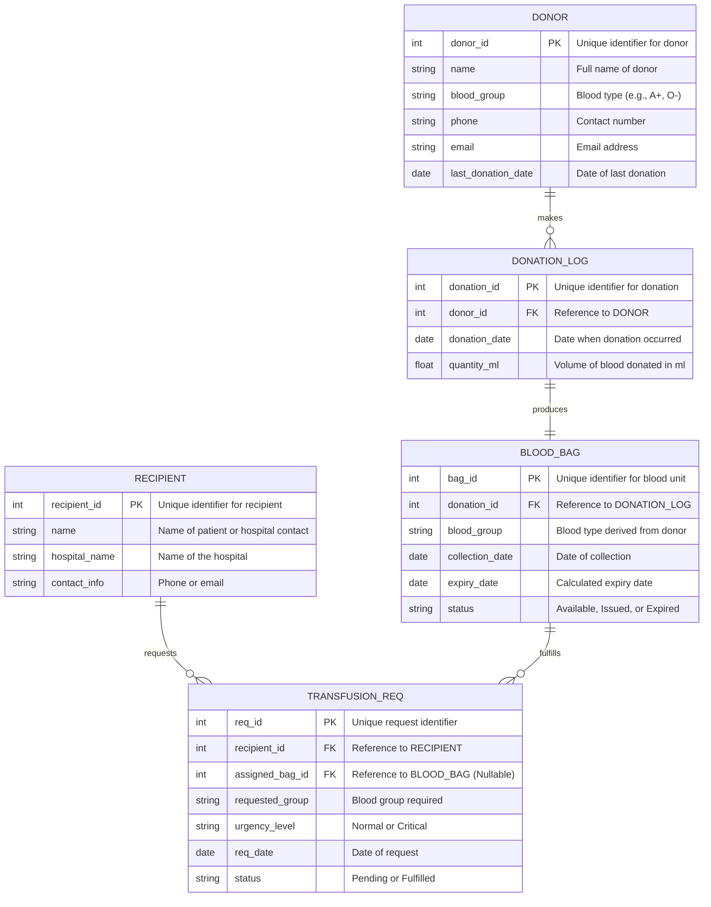

# Blood Bank Management System - ER Diagram

## Schema Details

-   **DONOR**: Stores permanent details of registered donors.
-   **DONATION_LOG**: Captures the event of a donation, linking a donor to a specific instance.
-   **BLOOD_BAG**: Represents the physical inventory. 1-to-1 mapping with a Donation Log (each donation produces one primary unit).
-   **RECIPIENT**: The entity requesting blood (Hospital/Patient).
-   **TRANSFUSION_REQ**: The transaction of asking for blood. Links to `BLOOD_BAG` only when the request is fulfilled (`assigned_bag_id`).

### Constraints
-   `PRAGMA foreign_keys = ON` is enabled.
-   `BLOOD_BAG.blood_group` must match `DONOR.blood_group` (enforced via application logic at creation).
-   `TRANSFUSION_REQ.assigned_bag_id` is unique per successful request (physically, one bag cannot fulfill multiple active requests).
